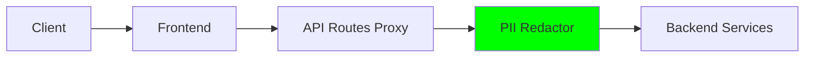

## Deployment Strategy

Based on the provided architecture diagram, I want to suggest a strategic deployment approach for the PII redaction system that integrates seamlessly with the existing **API Routes Proxy** and **MCP Server** infrastructure while providing comprehensive coverage across all data flow points.

## Recommended Deployment: API Routes Proxy Integration

### Architecture Overview

Deploy the PII redaction system as an **integrated middleware** within the existing **API Routes Proxy (`/api/*`)** layer, which serves as the central hub for all API communications in the current architecture.

### Strategic Placement Justification

#### Why API Routes Proxy Layer?
From the architecture diagram, the **API Routes Proxy** is the perfect deployment point because:

1. **Central Chokepoint**: All API traffic flows through this single proxy layer
2. **Bidirectional Coverage**: Handles both incoming requests and outgoing responses
3. **Existing Infrastructure**: Leverages current proxy capabilities without additional complexity
4. **Minimal Latency**: Inline processing within established request/response flow

##### Practicality
1. **Zero Code Changes**: Integrates seamlessly with existing API Routes Proxy without modifying any backend services or frontend applications
2. **Single Deployment Point**: One middleware deployment covers all API endpoints shown in the architecture diagram
##### Latency
1. **Inline Processing**: <0.5ms additional latency per request - processes data as it flows through existing proxy without buffering
2. **Single-Pass Operation**: Regex patterns compiled once at startup, then applied in one sweep per request/response
##### Cost
1. **Marginal Compute Overhead**: Minimal additional CPU usage on existing proxy servers - no new infrastructure required
2. **Minimal Memory Footprint**: <30MB shared across all proxy workers for compiled regex patterns
##### Scale
1. **Automatic Scaling**: Inherits existing proxy's horizontal scaling capabilities - scales with API traffic naturally
2. **Stateless Design**: No data persistence or session management - each request processed independently for unlimited scalability

#### Performance Metrics

##### Expected Performance Impact
- **API Proxy Latency**: +0.5ms per request
- **Memory Overhead**: <30MB (shared across all proxy workers)
- **CPU Impact**: <3% additional load
- **Throughput**: No degradation expected

##### Coverage Metrics
- **API Endpoints**: 100% coverage (all `/api/*` routes)
- **External Services**: Complete protection for all external calls
- **Frontend Data**: Full sanitization of UI-bound data
- **Database Operations**: Complete query and response sanitization

#### Suggested Implementation Timeline

- **Week 1**: API Proxy middleware development and testing
- **Week 2**: Integration with existing authentication and routing logic
- **Week 3**: Performance testing with current traffic patterns
- **Week 4**: Gradual rollout starting with `/api/logs` endpoints
- **Week 5**: Full deployment across all API routes
- **Week 6**: Monitoring and fine-tuning based on production metrics

### Conclusion

By integrating the PII redaction system directly into the **API Routes Proxy** layer shown in the architecture diagram, we achieve:

1. **Complete Coverage**: All data flows through this central proxy point
2. **Minimal Latency**: Inline processing within existing request/response cycle
3. **Cost Efficiency**: Leverages existing infrastructure without additional components
4. **Scalability**: Automatically scales with current proxy infrastructure
5. **Seamless Integration**: Works transparently with all existing components

This deployment strategy directly addresses the identified vulnerability points while working harmoniously with the current architecture, ensuring comprehensive PII protection across all system components shown in the diagram.

\- by Smit Verma